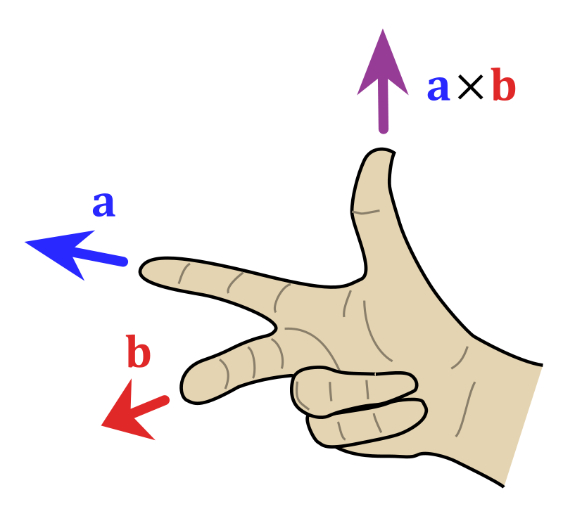

# Lineáris algebra

## Lineáris egyenletrendszerek

Egy egyenlet akkor lineáris, ha minden tényező legfeljebb első fokon szerepel benne (tehát nincs $x^2$, $x^3$, ...)

### Az egyenletek alakjai

#### Felsorolás

1. $2x - 5y = 8$
2. $3x + 9y = -12$

#### Vektorok

$
x\begin{bmatrix}2\\\\ 3\end{bmatrix} +
y\begin{bmatrix}-5\\\\ 9\end{bmatrix} =
\begin{bmatrix}8\\\\ -12\end{bmatrix}
$

#### Mátrixok

A mátrix az egy mxn méretű táblázat, amit fel lehet használni például egyenletek tárolására is:

$
\underline{\underline{A}} = \left[\begin{array}{cc|c}
 2 & -5 & 8 \\\\ 3 & 9 & -12
\end{array}\right]
$

A mátrixot kibővítettnek hívjuk, ha tartalmazza az egyenlet megoldásait is. Ennek jelölése: $[A\vert b]$

## Determináns

A determináns, az egy olyan függvény, amely egy számot rendel egy nxn típusú mátrixhoz.

Jelölése: A mátrix abszolút jelben $\left\vert\underline{\underline{A}}\right\vert$, vagy függvényként: $\det(A)$

### Geometriai jelentés

paralelepipedon előjeles térfogata (pofáncsapott téglatest)

### Nulla determináns jelentése

Ha az nxn típusú mátrix determinánsa nulla, akkor az csak egy n-nél kisebb dimenziós alakzatot tartalmaz (későbbiekben: lineáris összefüggőség).

Tehát ha egy 3x3-as mátrix determinánsa nulla, akkor a paralelepipedon valamely irányú kiterjedése nulla, tehát az igazából nem egy három dimenziós testet ír le.

### Determináns kifejtése

#### 1x1 determináns kifejtése

$\det(x) = x$ (önmaga)

#### 2x2 determináns kifejtése

$\begin{bmatrix}
a & b\\\\c & d
\end{bmatrix} $mátrix determinánsa = $ad - bc $

#### Nagyobb mátrix determinánsa

tetszőleges $1 \le i \le n$ esetén:

$$\sum_{j=1}^{n} \underline{\underline{A}}_{ij} \cdot (-1)^{i+j} \cdot \underline{\underline{D}}_{ij} $$

##### Értelmezési segédlet

- $\underline{\underline{A}}_{ij} $: A mátrix i-edik sorának j-edik eleme.
- $(-1)^{i+j} $A sakktábla színezése szerint változó előjel
- A $\underline{\underline{D}}_{ij} $aldeterminás úgy keletkezik, hogy elhagyjuk a mátrix i-edik sorát és j-edik oszlopát, majd az ennek a minormátrixnak vesszük a determinánsát.

### Kifejtési tétel

Egy determináns bármely sora vagy oszlopa alapján kifejthető és az eredmény minden esetben ugyan az lesz.

### Ferde kifejtés (Gauss-os)

Előnye, hogy sokkal kevesebb számítást igényel nagyobb (3x3, 4x4) mátrixok esetén

#### Átalakítás

Gauss elemináció segítségével előállítható egy ilyen mátrix: $
\begin{bmatrix}
a & - & -\\\\b & c & -\\\\d & e & f
\end{bmatrix}
$

##### Kiértékelés

**Tétel:** Egy alsó- vagy felsőháromszögmátrix determinánsa a főátlóban lévő elemeinek szorzata.

##### Visszaalakítás

Az eredeti determinánsérték visszafejtése a háromszögmátrixból:

- Egy sor szorzása egy skalárral: $D_2 = D_1 \cdot \lambda $(valamelyik tengely nyújtása)
- Ha valemelyik sorhoz hozzáadjuk a másik sor akárhányszorosát, akkor a determináns nem változik (ugyan az az alakzat, de egy más tengelyen felírva)
- Ha két szomszédos sort felcserélünk, akkor a determináns értéke mínusz egyszeresére változik (az előjel jelentése = nézőpont (lásd negatív sebesség), de a tengelyek most felcserélődnek)

###### Sorcserék

Ha bármely két sort cseréljük fel, akkor $2k+1 $, azaz páratlan számú cserét hajtunk végre.

Bizonyítás: Ha a két sor között pontosan k sor helyezkedik el, akkor mind a kettő sor k-nyit vándorol, a két sor cseréje pedig egy lépés.

Mivel páratlan számúszor invertálódik a determináns értéke, ezért (-1)-esére változik.

## Egyenletrendszerek megoldása

Egy egyenlet megoldható, ha léteznek olyan x, y, ... együtthatók, amelyeket az egyenletrendszerbe behelyettesítve az helyes értékeket fog adni.

Mátrixos alakban: $\underline{\underline{A}}\cdot \underline{x} = \underline{b}$, mely x vektor(ok) esetén?

### Megoldás Gauss eleminációval

A módszer lényege, hogy az eredeti $\underline{\underline{A}}\cdot \underline{x} = \underline{b}$ egyenletet egy ekvivalens, de könnyebben kezelhető $\underline{\underline{A_2}}\cdot \underline{x} = \underline{b_2}$ egyenletté alakítsuk, amelynek ugyan az a megoldása. (amcsi népszámlálásos példa)

Eszközei:

- Egy egyenlet szorzása skalárral
- Két egyenlet felcserélése
- Egy egyenlet hozzáadása egy másikhoz

Megfelelő átalakításokkal létrehozható a lépcsős alak, amelyet már egyszerűen meg lehet oldani felülről lefelé történő kifejtéssel:

$
\underline{\underline{A}} = \left[\begin{array}{ccc|c}
  a & - & - & b_1\\\\b & c & - & b_2\\\\d & e & f & b_3
\end{array}\right]
$

#### Nulla sor

Ha egy csupa nullásokból álló egyenletet kapunk, akkor az adott egyenlet elhagyható:
$
\underline{\underline{A}} = \left[\begin{array}{cc|c}
  1 & 1 & 2\\\\0 & 0 & 0
\end{array}\right]
$

#### Hiba sor

Ha egy olyan egyenletet kapunk, amiben az egyenlet bal oldala nulla és az egyenlet jobb oldala nem nulla, akkor az egyenletnek nincsen megoldása.

$
\underline{\underline{A}} = \left[\begin{array}{cc|c}
  1 & 1 & 2\\\\0 & 0 & 5
\end{array}\right]
$

#### Összefüggő egyenletek

Az előbbi példából látható, hogy lehetséges, hogy egy egyenletrendszernek nem létezik megoldása. Azonban az is lehetséges, hogy több megoldás is létezik.

Például a $2x + 0y = 4$ egyenletben az y értéke szabadon megválasztható.

Az XY síkon a értékkészletet kiszínezve az lenne látható, hogy a megoldások egy egyenesen helyezkednek el.

Két szabad változó esetén síkon, három vagy annál több szabad változó esetén pedig térben helyezkednek el a megoldások.

### Gauss-Jordan elemináció

Ha a lépcsők alak elérése után tovább folytatjuk az eleminációt, akkor kijöhet egy olyan egyenletrendszer, amelyről rögtön le lehet olvasni a megoldásokat:
$
\underline{\underline{A}} = \left[\begin{array}{ccc|c}
  a &   &   & 1\\\\& c &   & 2\\\\&   & f & 3
\end{array}\right]
$

Látható, hogy $x = 1$, $y = 2$, $z = 3$

### Cramer-szabály

Sokkal gyorsabb, ha az megoldásvektornak csak egy elemét szeretnénk kiszámítani.

Példa $x_2$-re, $\underline{\underline{A}}\cdot \underline{x} = \underline{B}$ esetén:

$$
\underline{x}_2 = \frac{\begin{vmatrix}
a & B_1 & c & d\\
e & B_2 & f & g\\
h & B_3 & i & j\\
k & B_4 & l & m
\end{vmatrix}}
{det(A)}
$$

Tehát $\underline{x}_i$ = az eredeti $\underline{\underline{A}}$ mátrix i-edik oszlopába beírt b vektor determinánsa, osztva $\underline{\underline{A}}$ determiánsával.

#### Bizonyítás

$\underline{x} = \underline{\underline{A}}^{-1}\cdot \underline{b}$

A mátrixszorzás szerint $\underline{x}_j$ -edik eleme = ${A^{-1}}_j \cdot b \implies \underline{x}_j = \frac{1}{det(A)} (A_{1j}B_1 + A_{2j}B_2 + …)$

Ha ebből indultunk volna ki: $ \frac{1}{det(A)}adj(A)\cdot b$, akkor is ugyan ezt kaptuk volna

### Inverz mátrixxal

Ha az $\underline{\underline{A}}\cdot \underline{x} = \underline{b}$ egyenletet balról szorozzuk A inverzével, akkor $\underline{x} = \underline{\underline{A}}^{-1}\underline{b}$

#### Tétel: Egyenletrendszer egyértelmű megoldhatósága

Az egyenletnek akkor és csak akkor létezik pontosan egy megoldása, ha $A^{-1}$ létezik.

#### bizonyítás

Létezik inverz = determináns nem nulla

ha $D \ne 0$, akkor nem összefüggő $\implies$ egyértelmű előállítás

### Mátrix inverzze

#### Egységmátrix

Def: $A \cdot E = A$ (vektortérnél részletesebben)

a 3x3-as egységmátrix: $\underline{\underline{E}} = \begin{bmatrix}
1 &   &  \\
  & 1 &  \\
  &   & 1
\end{bmatrix}$

Tehát ez az egység (1) kibővítése az $R^n$ térre.

#### Inverz kiszámítása Gauss eleminációval

Megfelelő lépésekkel el lehet jutni az $[\underline{\underline{A}}\vert \underline{\underline{E}}]$ mátrixból a $[\underline{\underline{E}}\vert \underline{\underline{A}}^{-1}]$ mátrixba

A fenti példában E az A-val azonos típusú egységmátrix.

#### 2x2 inverze adjungált segítségével

ha $\underline{\underline{A}} = \begin{bmatrix}
a & b\\\\c & d
\end{bmatrix}$, akkor $\underline{\underline{A}}^{-1}$ = $\frac{1}{ad - bc} \begin{bmatrix}
d & -b \\\\-c & a
\end{bmatrix}$

ahol $\det(A) = ad - bc$

Az adjungált mátrix pedig így áll elő:

- reverse(főátló)
- negative(mellékátló)

#### 3x3 inverze adjungált segítségével

Legyen $\underline{\underline{A}} := \begin{bmatrix}
a & b & c\\\\d & e & f\\\\g & h & i
\end{bmatrix}$

Ekkor ugye $\det(A) = a(ei - fh) - b(di - fg) + c(dh - eg)$

És $A^{-1}$ kiszámolásának lépései:

1. $B := A^T$
2. for each i, j: $adj(A)_{ij} = (-1)^{i+j}det(B_{ij})$
3. $A^{-1}$ := $\frac{1}{det(A)} adj(A)$

## Vektor

definíció: Egy irányított szakasz

$\vec{AB}$: A kezdőpontú és B végpontú szakasz

Eq: hossz és irány is megegyezik

### Nullvektor

$\underline{0}$ = $\vec{AA} \to$ hossza nulla

Definíció szerint iránya tetszőleges, így bármely vektorral párhuzamos és merőleges.

### Jelölések

| Jelölés | jelentés | megjegyzés |
--- | --- | --- |
|$\underline{a}$| a vektor |
|$\vert \underline{a} \vert$| a vektor hossza |
|$\vert \vert \underline{a} \vert \vert$| a vektor normája | a hossz általánosítása: $\sqrt{(a, a)}$ |
|$\underline{a} \parallel \underline{b}$| a párhuzamos b-vel | $\lambda \underline{a} = \underline{b}$ |
|$\underline{a} \perp \underline{b}$| a merőleges b-vel | $\underline{a}\cdot\underline{b} = 0$ |
|$\underline{a} = \underline{b}$| a és b ekvivalensek | hosszuk és irányuk megegyezik |
|$m(\underline{a}, \underline{b})$| a és b metrikája | távolsága

## Vektortér

A V nem üres halmaz vektorteret alkot egy T test felett, ha a T-n definiálva mind az absztakt összeadás, mind az absztakt skalárszoros művelet.

(programozási megközelítés: A vektortér egy interface, amelyet bármire lehet definiálni, ami teljesíti a lenti 11 axiómát (előfeltétel). Definiálásával rengeteg függvény elérhetővé válik a vektortér elemein (az interface-re definiált viselkedések))

Segítségével általánosítani lehet a vektorokat.

### Absztakt összeadás művelete vektorokon

Geometriai jelentés: Legyen b kezdőpontja a végpontja. Ekkor a + b = a kező- és b végpontja közötti vektor.

Az öt axióma:

| <!-- -->    | <!-- -->    | <!-- --> |
--- | --- | ---
| 1. | Az eredménye is eleme V-nek | zártság |
| 2. | $a + b = b + a$ | kommutatív |
| 3. | $(a + b) + c = a + (b + c)$ bizonyítás: bármely pontozott útvonalat választjuk, ugyan oda lyukadunk ki  | asszociatív |
| 4. | $0 + a = a = a + 0$ | semleges elem (bal- és jobb oldali) |
| 5. | $(-a) + a = 0 = a + (-a)$ ahol -a az az a hosszú, de azzal ellentétes irányú vektor | ellentett |

#### a + x = b esetén x egyértelmű

adjunk hozzá balról (-a)-t: $$ (-a) + a + x = (-a) + b $$,majd egyszerűsítsünk: $$ 0 + x = (-a) + b $$.Ellenőrzés: $$a + (-a + b\ ami = x) = b$$

### Absztrakt skalárszoros művelet vektorokon

geometriai jelentés: nyújtás + tükrözés, ha $\lambda < 0$

Az hat axióma:

| <!-- -->    | <!-- -->    | <!-- --> |
--- | --- | ---
| 1. | Az eredménye is eleme V-nek | zártság |
| 2. | $\lambda a = a\lambda$ | kommutatív |
| 3. | $\lambda_1 \lambda_2 a = \lambda_1 (\lambda_2 a)$ | asszociatív |
| 4. | $1 \cdot a = a$ | egységelem elem |
| 5. | $\lambda(a + b) = \lambda a + \lambda b $ | disztibutív 1 |
| 6. | $(\lambda_1 + \lambda_2)a = \lambda_1 a + \lambda_2 a$ | disztibutív 1 |

### Altér

Tegyük fel, hogy létezik $w$, ami részhalmaza a $v$ vektortérnek.

Ha $w$ elemeire is teljesül a 11 axióma (tehát $w$ is vektorteret alkot), akkor azt mondjuk, hogy $w$ altere $v$-nek

### Lineáris kombináció

Minden vektorhoz egy együtthatót rendelünk, majd vesszük ezek összegét:

$\lambda_1 a + \lambda_2 b + \lambda_3 c + ... \lambda_n v_n$

### Lineáris függetlenség

Két ekvivalens definíció (átrendezéssel kijönnek egymásból)

#### Definíció: nem tudják előállítani egymást

Az a, b, c, ... vektorok lineárisan függetlenek, ha egyikük sem állítható elő a többi lineáris kombinációjaként.

#### Definíció: a null vektor csak triviálisan előállítható

Az a, b, c, ... vektorok lineárisan függetlenek, ha a null vektor csak triviális módon állítható elő.

### Lineáris összefüggőség

Ha nem független, akkor összefüggő

#### Illeszkedés az egyenesre

$c = \lambda_1 a + \lambda_2 b$ és $\lambda_1 + \lambda_2 = 1$

c pontosan akkor illeszkedik az $\vec{AB}$ szakaszra, ha $\lambda_1 \in [0,1]$

$\alpha a + \beta b + \gamma c + ... = 0$, csak ha minden együttható nulla

### Generátorrendszer

Az $a_1$, $a_2$, ..., $a_n$ vektorok generálják V vektorteret, ha lineáris kombinációjukként bármely $x \in V$ előállítható.

Ekkor azt mondjuk, hogy $a_1$, $a_2$, ..., $a_n$ generátorrendszert alkot V-ben.

### Bázis

Egy lineárisan független generátorrendszer. Azért jó, mert egyértelműen állítja elő a vektortér elemeit.

#### Bázis elemszáma

pontosan annyi, ahány mint a lineárisan független vektorok maximális száma $V$-ben.

### Elemi bázistranszformáció

Tegyük fel, hogy az $a_1$, $a_2$, ..., $a_n$ vektorok bázist alkotnak V vektortér felett.

Legyen $v := \lambda_1 a_1 + \lambda_2 a_2 + ... + \lambda_n a_n$

Egy tetszőleges olyan i indexet kiválasztva, hogy $\lambda_i \ne 0$ *(mivel ezzel fogjuk leosztani a táblázat sorát)*

$a_1, a_2, ..., a_{i-1}, v, a_{i+1}, ..., a_n$ is bázisa a térnek.

(Az eredetiben kicserélve $a_i$-t, $v$-re)

#### Bizonyítás: generátorrendszer

Az eredeti $a_i$ vektor kifejezhető így:

$$
a_i = \sum_{j=1}^{i-1} \frac{\lambda_j}{\lambda_i} a_j + \frac{1}{\lambda_j} v - \sum_{j = i + 1}^{n} \frac{\lambda_j}{\lambda_i} a_j
$$

Segédlet a megjegyzéshez:

- $-\sum_{i \ne j} \frac{\lambda_j a_j}{\lambda_i}$ (a többi sor)
- $\frac{v}{\lambda_i}$ (a jelenlegi sor)

Legyen x egy tetszőleges eleme a vektortérnek. Tehát a régi bázisban
$$
x := \sum_{j=1}^{n} \xi_j a_j
$$

az új bázisban pedig

$$
x := \sum_{j \ne i} (\xi_j - \xi_i \frac{\lambda_j}{\lambda_i})a_j + \frac{\xi_i}{\lambda_i} v
$$

#### Bizonyítás: független (indirekten)

azért van rá szükség, mert ha generátorrendszer és független akkor bázis.

tegyük fel, hogy az új rendszer összefüggő: $\lambda_1 a_1 + \lambda_2 a_2 + ... + \lambda_i v + \lambda_n a_n = 0$

$\lambda_i$ - a kiindulási feltétel szerint - nem lehet nulla, ezért

$$
v = 0 a_i - \sum_{j \ne i} \frac{\lambda_j a_j}{\lambda_i}
$$

és ez valamiért ellentmondás.

saját értelmezés: ugye akkor összefüggő, ha nem minden $\lambda = 0$ és mégis előáll a nullvektor. v a kiindulási feltétel miatt nem lehet nulla, ezért nem minden együttható nulla. Szerintem v-t átvíve az egyenlet jobb oldalára ezt kapjuk.

#### Gyakorlatban (MateKing)

- p := generáló elem (fent az i-edik)
- q := a kiszámolandó elem
- r := p oszlopának és q sorának találkozásánál lévő elem
- s := p sorának és q oszlopának találkozásánál lévő elem

$$
q - \frac{rs}{p}
$$

### Kicserélési tétel

Az az $a_1$, $a_2$, ... $a_n$ rendszer lineárisan független, akkor a $b_1$, $b_2$, ..., $b_m$ bázisból k számú vektort az $a_1$, $a_2$, ..., $a_n$ vektorokkal helyettesítve ismét a tér bázisát kapjuk.

#### Bizonyítás

Tegyük fel, hogy a $b_1, b_2, ..., b_{i-1}$ vektorokat már lecseréltük a $a_1, a_2, ..., a_{i-1}$ vektorokra.

$$
a_1, a_2, ..., a_{i-1}, b_i, b_{i+1}, ..., b_n
$$

A bázistranszformáció tétel miatt az $a_i$ vektor beépíthető  a bázisba és az $a$ vektor új ellőállítása a következő lesz:

$$
a_i = \lambda_1 a_1 + ... \lambda_{i-1} a_{i-1} + \lambda_i b_i + \lambda_n b_n
$$

A kiindulási feltétel miatt tudjuk, hogy $a_i$ nem áll elő így: $a_i \ne \lambda_1 a_1 + ... \lambda_{i-1} a_{i-1}$ (hiszen lineárisan független), ezért valamelyik b-s együttható biztosan nem nulla.

Mivel ugyan annyi vektorunk van mint az eredeti bázisban és ezek továbbra is függetlenek, ezért ez egy bázis.

### Dimenzió

A V vektortér n dimenziós, ha tartalmaz n elemű bázist.

Magyarul: dimenzió: legnagyobb bázis elemszáma

Definíció szerint ha $V = \{\underline{0}\}$, akkor $dim(V) = 0$

#### Véges dimenzió (példák)

-$dim(R^n) = n$
-$dim(C^n) = n$

#### Nem véges dimenzió (példa)

Legyen $k := 0, 1, 2, ... \infty$

ekkor $\{1, x, x^2, ..., x^k\}$ polinomok lineárisan függetlenek.

ekkor a tér nem véges dimenziós.

### WIP: Dimenzió tétel

## Euklidészi tér

Ha egy V vektortérben definiálva van egy skaláris szorzat, akkor azt euklideszi térnek nevezzük.

### Absztrakt skalárszorzat

Két V-beli testhez render, egy harmadik testet: $(V, V) \to T$.

Geometriai jelentése: Az egyik vektor vetülete (árnyéka) a másikra.

1. $(x, y) = \overline{(y, x)}$, *ahol a felső vonal a komplex konjugáltot jelenti (valós számoknál elhagyható)*
2. $(x, \lambda y) = \lambda (x, y)$
3. $(x, y + z) = (x, y) + (x, z)$
4. $(x, x) \ge 0$ és $(x, x) = 0$, csak akkor, ha $x = 0$

### Norma (=hossz)

$\vert\vert x \vert\vert  = \sqrt{(x, x)}$

Axiómái:

- $\vert\vert x \vert\vert > 0$ és $\vert\vert x \vert\vert = 0$, csak akkor, ha $x = \underline{0}$
- $\vert\vert \lambda \cdot x \vert\vert = \vert\vert \lambda \vert\vert  \cdot \vert\vert x \vert\vert $
- $\vert\vert x + y \vert\vert \le \vert\vert x \vert\vert + \vert\vert y \vert\vert$ (háromszög egyenlőtlenség)
- $\vert\vert (x, y)\vert\vert^2 \le \vert\vert x\vert\vert^2 + \vert\vert y\vert\vert^2$ (Cauchy egyenlőtlenség)

### Hajlásszög

**Definíció:** $cos(a, b) = \frac{(a, b)}{\vert a \vert \vert b \vert }$

#### Koszinusz-tétel

Legyen $c := a-b$

Ekkor $c^2 = (a-b)(a-b) = (a, a) + (b, b) - 2(a, b) =$

$= \vert a \vert^2 + \vert b \vert^2 - 2 \vert a \vert \vert b \vert cos(a, b)$

### Ortogonális (=merőleges)

Definíció: $(a, b) = 0$

### Jobbrendszer

Megegyezés alapján az $\underline{a}$, $\underline{b}$, $\underline{c}$ független vektorok jobbrendszert alkotnak, ha az $\underline{a}$ és $\underline{b}$ vektorok által kifeszített síkot a $\underline{c}$ vektor irányából nézve létezik olyan $0 < \alpha \le \pi$ fokú elforgatás, hogy $forgat(b) = a$.

$\underline{c}$ irányából nézve, $\underline{b}$-t az óramutató járásának megfelelően legfeljebb 90 fokot kell forgatni, hogy megkapjuk $\underline{a}$-t

### Vektorális (kereszt) szorzat

Geometrikai jelentés: paralelogramma területe

$\vec{a}\times\vec{b} = \vert a \vert\vert b \vert \sin(a,b)e$, ahol $\underline{e}$ egy $\underline{a}$-ra és $\underline{b}$-re is merőleges vektor és \{$\underline{a}$, $\underline{b}$, $\underline{e}$\} jobbrendszert alkot.

#### Párhuzamosság vol. 2

Két vektor párhuzamos, ha $\lambda \underline{a} = \underline{b}$, de ez ekvivalens azzal, hogy $\underline{a} \times \underline{b} = \underline{0}$

#### Vektorális szorzat, determináns kifejtésével

$$
\vec{a}\times\vec{b} = \begin{vmatrix}
i & j & k\\
a_1 & a_2 & a_3\\
b_1 & b_2 & b_3
\end{vmatrix}
$$

##### Bizonyítás

Írjuk fel az a és b vektorokat egy i, j, k bázisban.

saját magával:

- $\underline{i} \times \underline{i}$ = $\underline{j} \times \underline{j}$ = $\underline{k} \times \underline{k}$ = 0

(i, j, k) sorrendben (jobbkéz):

- $\underline{i} \times \underline{j} = \underline{k}$
- $\underline{j} \times \underline{k} = \underline{i}$
- $\underline{k} \times \underline{i} = \underline{j}$

más sorrendben:

- $\underline{j} \times \underline{i} = -\underline{k}$
- $\underline{k} \times \underline{j} = -\underline{i}$
- $\underline{i} \times \underline{k} = -\underline{j}$

Ha a és b vektorok koordinátáit minden létező kombinációban ($a_ixb_i + a_ixb_j + a_ixb_k + a_jxb_i + ...$, majd a fenti felsorolás szerint egyszerűsítünk, akkor pont a determináns értékét fogjuk megkapni.

#### Vegyes szorzat

$\underline{a}\underline{b}\underline{c} = (\underline{a} \times \underline{b})\underline{c}$

Geometriai jelentése: Paralalopipedon előjeles térfogata
