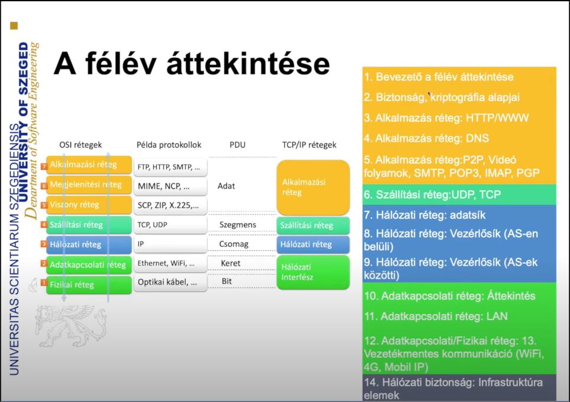

# Hálózatok

## Félév rendje

## Szoftverfejlesztőknek miért?

Nem csak kódolás!

- DevOps: Fejlesztési folyamatok automatizálása (tesztelés, review, deployolás)
- Adatbázisok

## Hálózatok fejlődése

- mainframe (70-80)
- kliensek (90)
- internet, web (00)
- felhő (05)
- mobil (10)
- köd (15)
- felhő & IOT trend (20)

## Internet

- nincs központja, szervezője, mivel "hálózatok hálózata"
- gráf
  - csomópont = forgalomiránytó

### Hálózati elemek

- Globális ISP (Internet Service Provider) = egész földet összekötő hálózat (műholdak, oceán alatti kábelek)
- Regionális ISP = UPC, digi, ...
- LAN = otthoni hálózat, cég hálózata

- +1: mobil hálózat, mivel bárki üzemeltetheti

#### Gráf nézőpont

- host: végberendezés, hálózati appokat futtat
- kapcsolatok: optika, réz, rádió
  - tulajdonság: sávszélesség = átviteli sebesség
- forgalomiránytó
  - célja: optimális kapcsolat keresése, fenttartása
- protokol = szabványrendszer, "közös nyelv"
  - RFC (request for comments) - http
  - IETF (internet engineering task force)

## Szolgáltatások

Interface-t biztosit a hálózati alkalmazások számára

### szolgáltatások története

- 1969: Arpanet
- 1973: TCP/IP
- 1976: IEEE (Ethernet)
- 1982: Internet
- 1990: www (world wide web)

### példa: Találkozás protokolja (egyszerű handshake)

1. köszönés
  - Szia Lajos!
  - Szia Feri!
2. kérdés
    - meg tudnád mondani az időt a telefonodon?
3. válasz
    - 2 óra van

## Az internet története

- Csomag-kapcsolás (60-)
    - nincs dedikált kapcsolat (cső)
    - helyette utak és a csomagok (autók) viszik az infót
    - **célja: decentralizálás** (hidegháborús katasztrófa utáni válaszcsapás)
- Autonómia (70-)
    - nincs közös pont, minden nodenak magának kell tárolnia a szükséges információkat
    - állapotmentesség
    - még inkább decentralizált
- internet (80-)
    - egyetemek is használták
    - protokollok (email)
- szolgáltatások
    - internet, mint közmű (messenger)
        - felhő parkok

### Hálózatok felbontása

### Area networks

- WAN: Wide area network (ISP)
- MAN: Metropolian (város / megye) area network
- LAN: Local area network (otthon)
- PAN: Personal area network (bluetooth)

### fa struktúra

- hálózat szélén: hostok (kliens | szerver)
  - csomagolás a host feladata
- fizikai közeg (vezeték | vezeték nélküli)
  - faktorok alapján (pl. sávszélesség)
- gerinc hálózat (core network)
  - forgalomiránytók (router)
  - hálózatok hálózata

### Csomagkapcsolás

store & forward elv:
- Van L bit adat és R bps sávszélességű kapcsolat
  - L Ethernet esetén 1500 Byte [MTU](https://en.wikipedia.org/wiki/Maximum_transmission_unit)
- szükséges idő (késleltetés = ping) = $ \frac{2L}{R} $

csomagvesztés:
  - Ha a router nem képes eltárolni M+1 darab beérkező csomagot, akkor el fog dobni egyet

### Router szerepe

forgalomiránytás:
  - Békéscsaba felé az 1-es porton (pl ethernet csatlakozón)

továbbitás:
  - forgalomirányitás szerint átmozgatja a csomagokat a portok között

### Alternatig gerinc (dedikált vonal)

#### Áramkör alapú (Multiplexálás)

- FDM = Frekvencia alapú (lásd: rádió)
- TDM = idősáv alapú

#### Csomag alapú

- olcsóbb
- kevésbé megbizható (közös erőforrás másokkal, lásd UPC)

## Hálózatok hálózata

ISP-k globális ISP-khez kapcsolódnak

globális ISP-k között Internet Exchange Point (IXP)-k

### ISP-k

- Tier 1: Például az egyetemek hálózata, nem áll senki sem fölötti
- Tier 2: Például az SZTE hálózata
- Hozzáférési hálózatok (pl. egy adott kollégium)

#### Hozzáférési hálózat

- modem: kapcsolat a külső és belső hálózat között
- router: forgalomiránytó 
- switch: kapcsoló (nagyon egyszerű router)
- firewall: tűzfal (szűrés)
- NAT: belső és külső cimek közötti kapcsolat
- kötegek: vezetékes és vezeték nélküli belső kapcsolatok TODO: angolul?

## Layer 1: Fizikai közeg

TODO

- bit: adó/vevő párok között terjed
- fizikai vonal: adó és vevő között
- irányitott közeg: közeg haladási iránnyal (réz, üveg)
  - TP (Twisted pair - csavart érpár), 100 Mbit/s, 1 Gbit/s, 10 Gbit/s
  - koaxiális kábel: Két koncentrikus réz vezeték, kétirányú
  - optikai kábel: üvegszál amin fény megy
    - nagy sebesség (100 Gbit/s)
    - alacsony hibaarány (nem mágneseshetezhető)
- irányitatlan közeg: közeg szabad terjedéssel (rádió: WiFi, műholdas)
  - kétirányú
  - környezeti hatások (reflexió, interferencia, akadályok)

## Késleltetések

$d_{csomopont}$ =
  - $d_{feldolgozas}$
    - bithibák ellenőrzése
    - kimeneti vonal meghatározása
    - TTL (Time To Live = maradék ugrások száma) újraszámolás miatt az ellenőrzőködot (hasht) is újra kell számolni
  - $d_{sorbanallas}$
    - várakozás a kimeneti port felszabadulására
  - $d_{tovabbitas}$
    - sávszélességtől függ (bit/s)ű
    - $t = \frac{bit}{bit/s}$

