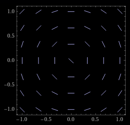

# Kalkulus II. gyakorlat

- By: Benedek Gábor, M04 (CooSpace)

- CooSpacen jegyzet
- Szabó Tamás videók

## Követelmények

- 6 röpi, 3. héttől 2 hetente, 30 perc 2-3 feladat a példatárból

- 6 pont / röpi
- a legrosszabb nem számít
- $\sum = 30$

### Osztályzatok + megajánlott jegy

0. 0-4
1. 5-9
2. 10-17 (10-19)
3. 18-21 (20-24)
4. 22-25 (25-30)
5. 26-30 (szóbeli)

### Pluszpont

- diákban hiba találás

## Differenciál egyenletek

- Függvény egyenletek
- Függvény deriváltja is szerepel benne

### Jelölések

- $y = y(x)$ - az ismeretlen függvény (rövidített jelölés)
- $y' = \frac{dy}{dx}$ - derivált függvény

### Fajtái

- elsőrendű: csak első derivált $6y' + 2y = cos(x)$
- másodrendű: van másodrendű derivált $y'' + x = 5$

### Iránymező rajzolás

$y' = -\frac{x}{y}$, $y \ne 0$

- $(x=1,y=2) \to y' = -\frac{1}{2}$

#### kiszámolás menete

$y' = k$

Egyenesek mentén:

$k = 0, +1, -1, +0.5, -0.5, +2, -2, ...$

##### Ha $k = -\frac{1}{2}$

$$ -\frac{x}{y} = -\frac{1}{2} $$
$$\frac{x}{y} = \frac{1}{2} $$
$$2x = y $$

#### 24 irányvonal mentén

#### Sejtés

A megoldások körben helyezkednek el $x^2 + y^2 = c, c \ne 0$

### Szétválasztható diff. egyenlet

várt alak: $f(y)\cdot y' = g(x)$

- bal oldal csak y-től függ
- jobb oldal csak x-től függ

#### Feladat

0. $(x+1)y' = \frac{y}{x}$ // szétválasztás x és y-os tagokra
1. $\frac{1}{y}(x+1)y' = \frac{1}{x}$ // $\cdot (x+1)$
2. $\frac{1}{y}y'$ = $\frac{1}{x(x+1)}$
    - $f(y) = \frac{1}{y}$
    - $g(x) = \frac{1}{x(x+1)}$
3. $\frac{1}{y} \frac{dy}{dx}$ = $\frac{1}{x(x+1)}$ // átszorzás dx-el
4. $\frac{1}{y} dy$ = $\frac{1}{x(x+1)} dx$ // integrálás oldalonként
5. $ ln\left\vert y\right\vert  + C_1$ = $\int(\frac{A}{x} + \frac{B}{x+1})$, $C_1 \in R$
    - most: parciális törtekre bontás
    - $1 = A(x+1) + B(x)$
    - $x=-1 \to$ $1 = B(-1) \to$ $B=-1$
    - $x=0  \to$ $1 = A(1) \to$ $A=1$
6. $ln\vert y\vert  + C_1$ = $ln\vert x\vert  - ln\vert x+1\vert  + C_2$, $C_2 \in R$
    - ennek a neve: implicit megoldás
7. $ln\vert y\vert $ = $ln\left\vert \frac{x}{x+1}\right\vert  + C$, $C = C_2 - C_1$
    - legyen minden logaritmus alakban
8. $ln\vert y\vert $ = $ln\left\vert \frac{x}{x+1}\right\vert  + ln(C)$, $C > 0$
9. $ln\vert y\vert $ = $ln(c\cdot\left\vert \frac{x}{x+1}\right\vert )$, mivel ln sz.m.
10. $\vert y\vert  = c\left\vert \frac{x}{x+1}\right\vert $
11. y = $+/- c\left(\frac{x}{x+1}\right)$
    - ez az explicit megoldás, y ki van fejezve
12. Ha $c = 0$, mint a 8. pontban
    - $y = 0$ megoldás
